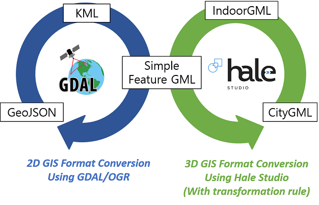

# OpenGDS_Conversion
OpenGDS/Conversion Tools is a Java-baed open source program that performs conversion between international standard formats.

## License
OpenGDS/Conversion Tools licensed under the GNU Lesser General Public License (LGPL) v3.0.

## Getting Started
The follwing tools are required to build OpenGDS/Conversion:
* Java Development Kit 8 (JDK 8)
* [Hale Studio 3.5](https://www.wetransform.to/downloads/)
* [GDAL/OGR](https://trac.osgeo.org/osgeo4w/)

```
1) Clone this project
2) mvn install
3) mvn exec:java
```
## Support GIS Format
* IndoorGML
* CityGML
* GML (Simple Feature)
* KML
* GeoJSON



## Processing step for conversion


1) Set static information
    * Hale Studio binary file location
        * Select the installed location (until HALE folder)
    * GDAL/OGR binary file location
        * Select the installed location (until bin folder)
2) Select the source format and the target format
3) Set dynamic information
    * Select the source file location
        * It have to matched with selected source format
    * Select the target file location
        * It have to matched with selected target format
        * User have to write until file extension
    * (Optional) Select the transformation rule file location
        * If user want to convert to (or from) IndoorGML and CityGML, user have to select the transformation rule file
        * It is located in [res](/res) folder of OpenGDS/Conversion project
4) Push transform button 

## Author
* **Taehoon Kim** - taehoon.kim@pnu.edu
